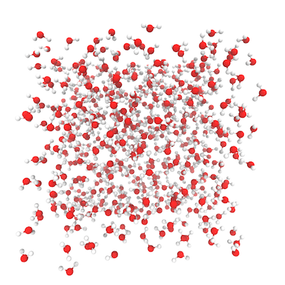
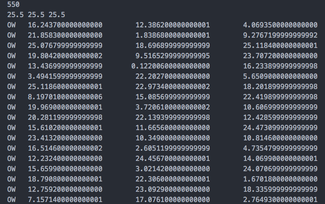
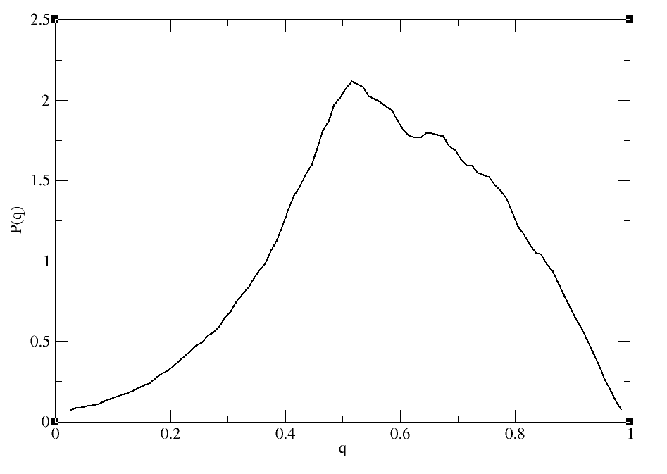
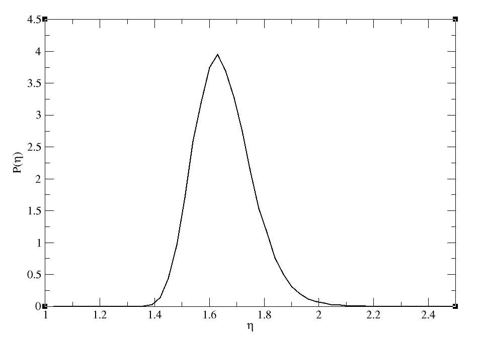

5 minutes tutorial
==================

System
------

1. Obtain the trajectory from the molecular dynamics production run.

.. note:: Example system :  550 TIP3P water molecules with box
  length of 25.5 Å * 25.5 Å * 25.5 Å

2. Generate the **xyz file** (input for the order package) from the trajectory
with the atoms necessary to calculate the local structure.

.. note:: This xyz file should include all the water Oxygen atoms and all the
  other atoms that are cosidered as the closest neighbors.
  **Make sure to follow the following file format for the xyz file.** In this
  example the central Oxygen atoms of water are named as "OW".

**Line #1 :** Number of atoms

**Line #2 :** BoxlenghtX(Space)BoxlenghtY(Space)BoxlenghtZ

**Line #3 & onwards :** Symbol assigned by the user for the central atom and
the other atoms that can be considered as the closest neighbors

**3. Commands available in the package**

.. code-block:: console

 $order [input] [-h] [-t TASK] [-c CENTER] [-b BINS] [-f FREQUENCY] [-p PLOT]

 input

 File name of the xyz file

 -h

 Show this help message and exit

 -t TASK

 Specification of the type of task that you need to perform. TASK can
 be oto or tto or avc (default: oto).
 If you need to perform multiple tasks simultaneously use a "," to
 separate the tasks. (Ex : tto,oto)

 -c CENTER

 Type of center atom (default: 'O')
 (In the example mentioned above the center is 'OW')

 -b BINS

 Number of bins for the parameter (default: 100)

 -f FREQUENCY

 Compute the parameter every n frame(s) in the xyz file(default: 1)

 -p PLOT

 Turn on / off of plotting (default: on)

Orientational Tetrahedral Order **(OTO)**
-----------------------------------------

This is the most common type of tetrahedral ordr paramater that is being used.
This order parameter uses the four closest water Oxygen neighbors for the calculation.
The value of q can rang from 0 to 1, where 0 is for an ideal gas and 1 is for a regular tetrahedron.

.. math::

   q = 1 - \frac{3}{8}\sum_{j=1}^{3}\sum_{k=j+1}^{4}\left ( \cos \psi _{jk}+\frac{1}{3} \right )^{2}

q    = Orientational tetrahedral order parameter

ψ\ :sub:`jk`\  = Angle formed by the Oxygen atom under consideration & the two
nearest neighbor atoms *j* & *k*

.. code-block:: console

   $order test.xyz -t oto -c 'OW' -f 5

Translational Tetrahedral Order **(TTO)**
-----------------------------------------

Similar to orientational tetrahedral order. But here, the variance of the
radial distnace between the central water Oxygen atom and the four nearest neighbors are calculated.
THe value of S\ :sub:`k`\ is close to 1 and quals 1 for the perfect tetrahedron.
As the local tetrahedral nature increases, S\ :sub:`k`\ becomes more closer to 1.

.. math::

   S_{k} = 1 - \frac{1}{3}\sum_{k=1}^{4}\frac{(r_{k} - \bar{r})^2}{4\bar{r}^2}

S\ :sub:`k`\  = Translational tetrahedral order parameter

r\ :sub:`k`\  = Radial distance from the cental Oxygen atom to the *k* th peripheral closest neighbor

:math:`\bar{r}` = Arithmatic mean of the four radial distances

.. code-block:: console

   $order test.xyz -t tto -c 'OW' -f 5

You can get the average S\ :sub:`k`\ value for your system by getting the average
value of the **raw_data** output file.

Average value for S\ :sub:`k`\ for the example is 0.998892128

Asphericity of the Voronoi Cell **(AVC)**
-----------------------------------------

Asphericity parameter (:math:`\eta`) can be used to characterize the shape of the
Voronoi polyhedron. This value is independent of the size of the polyhedron.
The value of :math:`\eta` for a perfect sphere the is 1, for ice is 2.25 and
for a regular tetrahedron it is 3.31. [Duboué-Dijon2015]_

.. math::

   \eta = \frac{A^3}{36\pi V^2}

:math:`\eta` = Asphericity parameter

*A* = Area of the polyhedron

*V* = Volume of the polyhedron

.. code-block:: console

   $order test.xyz -t avc -c 'OW' -f 5

.. [Duboué-Dijon2015]
  DOI: 10.1021/acs.jpcb.5b02936
